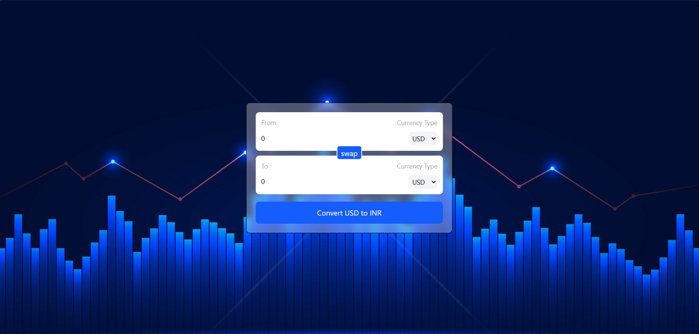
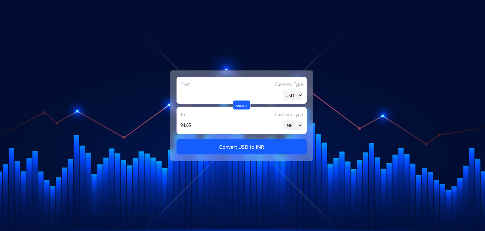

# Currency Converter

A modern and responsive currency converter built with **React**, **Vite**, and **Tailwind CSS**. The application fetches live exchange rates and enables users to convert between multiple international currencies instantly through a clean and intuitive interface.

## Live Demo

**https://currency-converter-nezt.vercel.app/**

---

## API Used

This project uses the **ExchangeRate API** to fetch real-time currency exchange rates.

- API: [https://api.exchangerate-api.com/v4/latest/USD](https://api.exchangerate-api.com/v4/latest/USD)

---

##  Features

*  Convert between multiple international currencies
*  Real-time exchange rates fetched from an external API
*  One-click currency swap
*  Instant conversion with dynamic updates
*  Fully responsive design for desktop, tablet, and mobile
*  Modern UI with a clean background and glassmorphism-inspired card
*  Built using reusable React components and custom hooks

---

## 🛠️ Tech Stack

* React
* Vite
* JavaScript (ES6+)
* Tailwind CSS
* React Hooks
* Currency Exchange API

---

##  Project Structure

```text
src/
│── assets/
│── components/
│   ├── InputBox.jsx
│   └── index.js
│
│── hooks/
│   └── useCurrencyInfo.js
│
│── CurrencyConverter.jsx
│── main.jsx
│── index.css
```

---

##  Installation

Clone the repository

```bash
git clone https://github.com/Radhikagupta25/CurrencyConverter.git
```

Navigate to the project

```bash
cd CurrencyConverter
```

Install dependencies

```bash
npm install
```

Start the development server

```bash
npm run dev
```

---

##  How It Works

1. Enter the amount to convert.
2. Select the source currency.
3. Select the target currency.
4. Click **Convert**.
5. The application fetches the latest exchange rate and displays the converted value instantly.
6. Use the **Swap** button to interchange the selected currencies.

---

## 📸 Screenshots

### Home Page



### Currency Conversion



---

##  Concepts Practiced

* React Functional Components
* State Management using `useState`
* Custom Hooks
* API Integration
* Component Reusability
* Props
* Dynamic Rendering
* Responsive UI Design
* Modern React Project Structure

---

## Future Improvements

* Conversion history
* Favorite currencies
* Dark / Light mode
* Currency trend charts
* Historical exchange rates
* Offline caching
* Searchable currency dropdown

---

## Author

**Radhika Gupta**

GitHub: https://github.com/Radhikagupta25

---

If you found this project useful, consider giving it a ⭐ on GitHub!
